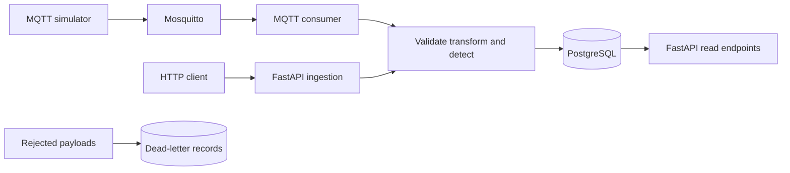

# Reviewing and running the telemetry pipeline

## What each interface shows

The GitHub Pages dashboard simulates events in JavaScript. The root page served by the local FastAPI application uses the same `index.html` and `assets/` code, so its charts also show browser simulation data. Opening `http://localhost:8000/` does not demonstrate that MQTT events have reached PostgreSQL.

Use `/docs`, `/readings/latest`, `/analytics/summary` and `/pipeline-events` to inspect the actual backend. Connecting the dashboard to those endpoints is a separate implementation task.

## Start the backend stack

Install Docker with Compose support, clone the repository, then run from its root:

```powershell
git clone https://github.com/Billalhossainshishir/real-time-data-engineering-pipeline.git
cd real-time-data-engineering-pipeline
docker compose up -d --build
docker compose ps
docker compose logs --tail 50 worker simulator
Invoke-RestMethod http://localhost:8000/health
Invoke-RestMethod http://localhost:8000/analytics/summary
Invoke-RestMethod http://localhost:8000/readings/latest
```

Expect healthy API/database status and stored readings after the MQTT publisher has produced events. Confirm reading `source` values through the API instead of using browser chart activity as proof. The stack exposes host ports 8000, 5432 and 1883; port conflicts must be resolved before startup.



The Python-only route in the README uses Python 3.13 and SQLite by default. `DATABASE_URL` is read from the process environment; creating a `.env` file alone does not make the Python application load it. Docker's environment entries are configured in `docker-compose.yml`.

## Reproducible checks

In Swagger, send the event from `docs/api.md` to `POST /events`. Inspect `/readings/latest` for its transformed fields. Submit an out-of-schema value to exercise validation, then inspect `/dead-letter`. Use the documented threshold values to produce an alert and inspect `/alerts`.

The detectors short-circuit in order: rules, rolling statistics, then Isolation Forest. Rolling statistics need at least 10 prior normal readings for that device; Isolation Forest needs 25. An injected extreme value will normally exercise the rule detector, not prove that Isolation Forest ran.

The in-process simulator endpoints control the API's simulator only. They do not pause or reset the separate MQTT publisher container. For a controlled manual HTTP experiment, first stop the MQTT producers with `docker compose stop simulator worker`.

Run `python -m pytest -q` inside an environment with the repository requirements installed. The unit/API suite covers validation, transformation, rule/statistical alerts and related endpoints. It does not contain a dedicated Isolation Forest assertion. The GitHub Actions workflow additionally builds Compose and checks that MQTT events reach the database; this is stronger evidence for ingestion than the dashboard alone.

## Data and limits

All sensor readings are simulated. Detection thresholds are demonstration choices, not validated building or water-utility operating limits. Model output is not a validated safety alarm.

`docker compose down` stops the stack while keeping its named database volume. `docker compose down -v` also deletes that demonstration database. Export any records you want to retain first.

If events do not appear, inspect broker, worker and simulator logs separately. If the browser charts move but the API is empty, you are seeing the independent simulation, not evidence of a working MQTT pipeline.


## Recorded verification evidence

At documentation review, the existing [GitHub Actions test run](https://github.com/Billalhossainshishir/real-time-data-engineering-pipeline/actions/runs/35169483277) reported `success` for `f57ca3d847efcc66e1a206f7be7a5d14f5a9e94d`. This records an existing CI result; the documentation review did not install dependencies or rerun the application locally. Commands above were checked against source files and configuration. A successful CI run does not establish production readiness or validate untested UI integrations.
