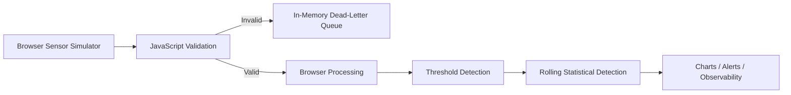
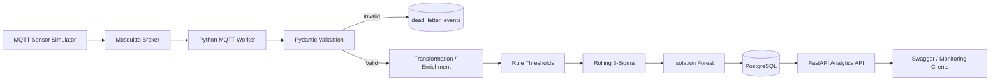
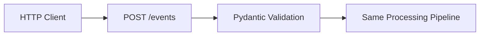

# Architecture

## 1. Public recruiter demo

The GitHub Pages site is a static client-side demonstration. It exists so a recruiter can understand the project in under a minute without a login or backend dependency.



This layer is intentionally **not presented as a hosted FastAPI/PostgreSQL/MQTT system**.

## 2. Full engineering implementation

The repository also contains the server-side pipeline below.



HTTP ingestion is supported in parallel:



## 3. Data model

### `devices`

Registered sensor metadata:

- stable `device_id`
- room name
- floor
- zone
- active status

### `sensor_readings`

Stores accepted transformed events:

- raw measures: temperature, humidity, energy usage
- derived `energy_watts`
- temperature/humidity/energy bands
- comfort status
- normalized timestamp
- processed timestamp
- anomaly flag
- anomaly method
- anomaly score
- anomaly reason
- ingestion source

### `alerts`

Operational alerts created by anomaly detectors.

### `pipeline_events`

Audit/observability records for ingestion, validation, transformation, storage and detection stages.

### `dead_letter_events`

Rejected payload, error reason, source and timestamp.

## 4. Transformation layer

The backend does more than validate and persist. `backend/services/transformations.py`:

1. normalizes timestamps to UTC
2. rounds sensor values consistently
3. converts kW to watts
4. derives temperature bands
5. derives humidity bands
6. derives energy bands
7. derives a comfort status

The transformed fields are persisted alongside the original sensor values.

## 5. Anomaly strategy

`backend/services/anomaly_detection.py` applies detectors in sequence.

### Level 1 — deterministic rules

Immediate protection for obvious failures:

- temperature `< 10°C` or `> 35°C`
- humidity `< 15%` or `> 85%`
- energy `> 7.5 kW`

### Level 2 — rolling statistics

Once at least 10 normal readings exist for a device, the service compares a new reading with the latest rolling window. A z-score of at least `3.0` triggers the statistical detector.

### Level 3 — Isolation Forest

After at least 25 normal readings are available, temperature, humidity and energy are standardized and evaluated together with `IsolationForest`.

This demonstrates the difference between transparent operational rules, interpretable statistical detection and multivariate ML detection.

## 6. MQTT path

The Docker stack contains:

- `mqtt`: Eclipse Mosquitto broker
- `simulator`: Python telemetry publisher
- `worker`: MQTT consumer / processor
- `db`: PostgreSQL
- `api`: FastAPI

The simulator publishes to topics such as:

```text
building/sensors/ROOM-07
```

The worker subscribes to:

```text
building/sensors/#
```

Invalid MQTT payloads are persisted to the dead-letter table instead of crashing the worker.

## 7. Observability

The backend stores pipeline-stage events for:

- INGESTION
- VALIDATION
- TRANSFORMATION
- STORAGE
- DETECTION

The API exposes those events through `GET /pipeline-events`, allowing the processing path to be inspected without relying only on application logs.

## 8. Deployment boundary

The GitHub Pages frontend is currently independent from the backend. That is intentional for the portfolio version.

A future hosted version could use:

```text
GitHub Pages → hosted FastAPI → hosted PostgreSQL
                          ↕
                     MQTT worker
```

The current repository already contains the backend code and local Docker infrastructure required for that next deployment stage.


## Current execution boundary

The FastAPI root serves the same independent browser dashboard as GitHub Pages. Serving that page locally does not connect its charts to the API database. Use read endpoints or Swagger to verify stored telemetry; a backend-connected dashboard remains future work. See [the reviewer guide](REVIEWER_GUIDE.md).
